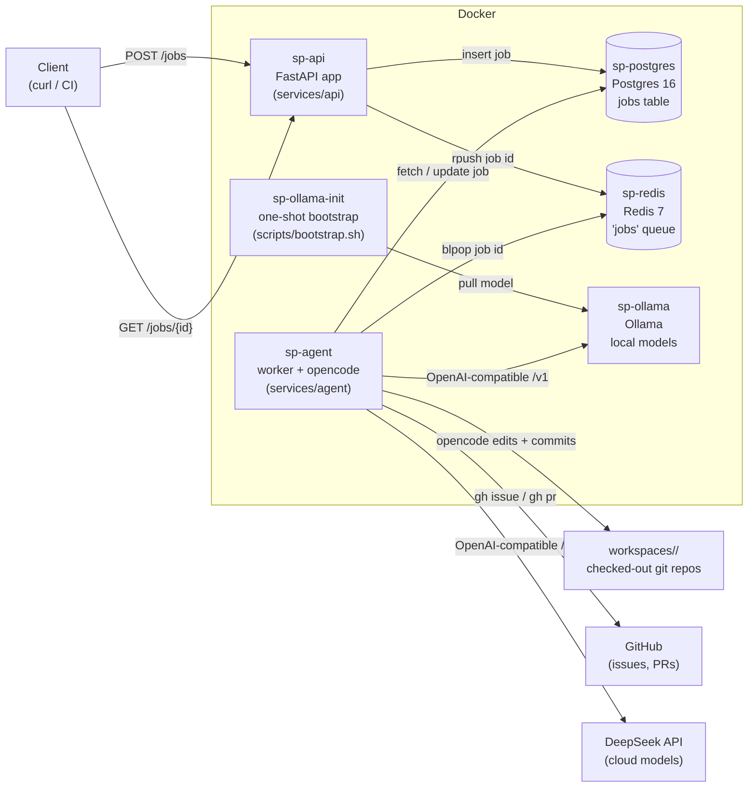

# Architecture

Software Press is a containerized agentic system that turns prompts (or GitHub
issues) into real code written, committed, and - for issues - pushed to GitHub
as a pull request. An AI coding agent runs inside a Docker container and does
the actual editing against a checked-out copy of your repository.

## High-level flow

1. A client submits a **job** to the API via `POST /jobs`, either as an *ad hoc
   prompt* or a *GitHub issue number*.
2. The API validates the request, inserts a row into **Postgres**, and pushes the
   job id onto a **Redis** queue.
3. The **agent** worker block-pops the job id off the queue, loads the job from
   Postgres, and marks it `running`.
4. For issue jobs it fetches the issue (and its comments) from GitHub via the
   `gh` CLI, then wraps it into a prompt.
5. The agent runs **opencode** (the CLI agent) in the target repo's workspace,
   pointed at the requested model (local **Ollama** or cloud **Deepseek**).
6. opencode writes files and commits them with git. For issue jobs the agent
   pushes the branch and opens a pull request.
7. The agent records the outcome (success/failure, PR number, artifact paths)
   back in Postgres; the client can poll `GET /jobs/{job_id}` for the result.

## Container diagram



## Components

### sp-api (`services/api`) - REST API

A FastAPI service (port `8000`) that exposes:

- `GET /health` - reports connectivity to Postgres and Redis.
- `POST /jobs` - accepts either a `prompt` (ad hoc) or an `issueNumber`
  (GitHub issue) plus an optional `model` (`provider/model` format, e.g.
  `deepseek/deepseek-v4-pro`). Exactly one of `prompt`/`issueNumber` must be
  set. It creates a UUID job id, inserts a `queued` row into Postgres, and
  pushes the job id onto the Redis `jobs` queue.
- `GET /jobs/{job_id}` - returns the job's status, prompt, error, artifact
  path, and pull request number.

### sp-agent (`services/agent`) - worker

A Python process (`python -m app.runner`) that loops forever, blocking on the
Redis `jobs` queue. For each job it:

1. Fetches the job from Postgres (`app/db.py`).
2. Validates the requested model against the configured opencode providers and
   that the repo exists under `WORKSPACES_ROOT`.
3. For issue jobs, fetches the issue + comments via the `gh` CLI
   (`app/GithubClient.py`) and builds a prompt.
4. Creates an artifact directory under `ARTIFACT_ROOT` (e.g.
   `artifacts/20260811180005-<job_id>/`) and marks the job `running`.
5. Runs `opencode run --agent build --model <model> "<prompt>"` in the repo's
   working directory (`app/runner.py:_run_prompt`). Command output is streamed
   to `output.txt`.
6. Stages and commits any changes (`app/GitClient.py`). A `prepare-commit-msg`
   git hook invokes opencode again to auto-generate a Conventional Commits
   message.
7. For issue jobs: pushes the `feature/...` branch to origin and creates a pull
   request via `gh pr create`; for ad hoc jobs it only commits locally.
8. Records `completed`/`failed` status, any error, and the PR number in
   Postgres.

### sp-postgres - job store

Postgres 16 holding the `jobs` table (schema in `migrations/001..005`):

| column | purpose |
| --- | --- |
| `id` | UUID primary key |
| `prompt` | the prompt text (nullable for issue jobs) |
| `issue_number` | GitHub issue to resolve, if any |
| `repo` | `org/repo` targeted by the job |
| `model` | requested `provider/model`, optional |
| `status` | `queued` / `running` / `completed` / `failed` |
| `artifact_path` | artifact directory for the job |
| `error` | error text on failure |
| `pr_number` | created pull request, if any |
| timestamps | `created_at`, `started_at`, `completed_at` |

### sp-redis - job queue

Redis 7 backing a simple list queue named `jobs`. The API `RPUSH`es job ids;
the agent `BLPOP`s them. This decouples the API from the worker so jobs are
never lost if the agent restarts mid-queue.

### sp-ollama + sp-ollama-init - local model serving

`sp-ollama` serves local models over an OpenAI-compatible API
(`http://ollama:11434/v1`). `sp-ollama-init` is a one-shot container that waits
for Ollama and pulls the default model (`qwen2.5:0.5b`, overridable via
`OLLAMA_MODEL`). The Qwen model is underpowered and intended mainly for testing
Ollama connectivity; heavier workloads use the Deepseek cloud models.

### DeepSeek - cloud provider

Deepseek's API (`https://api.deepseek.com/v1`) provides the `deepseek-v4-pro`
and `deepseek-v4-flash` models, configured as opencode providers. The agent
authenticates via `DEEPSEEK_API_KEY`.

## Model providers

Both providers are declared in `services/agent/opencode-config.json` and use the
`@ai-sdk/openai-compatible` provider:

| provider | models | endpoint |
| --- | --- | --- |
| `sp-ollama` | `qwen2.5:0.5b` | `http://ollama:11434/v1` (in-cluster) |
| `deepseek` | `deepseek-v4-pro`, `deepseek-v4-flash` | `https://api.deepseek.com/v1` |

The default model (`deepseek-v4-flash`) comes from `OPENCODE_PROVIDER` /
`OPENCODE_MODEL` env vars. A job may override it via the `model` request field,
which the agent validates against `available_models()` (read from the opencode
config) before running.

## Data / mount points

| path | owner | purpose |
| --- | --- | --- |
| `workspaces/<org>/<repo>` | agent | checked-out repos opencode edits |
| `artifacts/<timestamp>-<job_id>/` | agent | `prompt.txt`, `output.txt` per job |
| `datasets/` | agent | mounted for future dataset work |
| `logs/` | agent | mounted for agent logging |
| `models/ollama/` | ollama | Ollama model storage |

## How to run a job

```
curl -X POST http://localhost:8000/jobs \
    -H "Content-Type: application/json" \
    -d '{"repo": "example/foobar", "prompt": "Write a hello world script", "model": "deepseek/deepseek-v4-pro"}'

curl -X POST http://localhost:8000/jobs \
    -H "Content-Type: application/json" \
    -d '{"repo": "example/foobar", "issueNumber": 42}'
```

Then poll `curl http://localhost:8000/jobs/{job_id}` until `status` becomes
`completed` (or `failed`).
